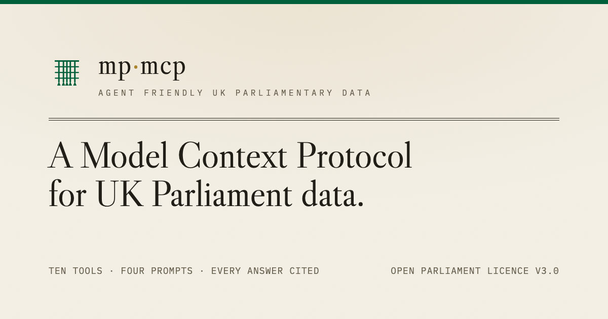

# UK Parliament Model Context Protocol

[](https://github.com/jamesmccomish/mp-mcp/actions/workflows/ci.yml)
[](https://www.npmjs.com/package/@jamesmccomish/mp-mcp)
[](LICENSE)
[](https://www.parliament.uk/site-information/copyright-parliament/open-parliament-licence/)


 
> Ask a question in plain English about any MP, debate, or vote and have an agent answer it with structured data direct from official Parliamentary sources.

UK Parliament does an amazing job of publishing data: every vote, debate, bill, MP's declared interests, and more is available to the public. But this is scattered across a dozen separate APIs.

That means answering a question as ordinary as *"how has my MP voted on climate?"* means stitching several endpoints and schemas together by hand, or worse, relying on third-party data sources which are often opinionated or out of date.

`mp-mcp` gives your agent an efficient way to navigate Parliament's data, and ensures responses are returned as structured JSON so they can be presented clearly, or direclty consumed by your application.

The aim is to lower the barrier to engage with Westminster for the civically-curious public, by providing clear, officially cited answers to questions about Parliament.

## What's in the repo


| Path                                                   | What it is                                                                                                                                                             |
| ------------------------------------------------------ | ---------------------------------------------------------------------------------------------------------------------------------------------------------------------- |
| `[packages/mp-mcp](packages/mp-mcp)`                   | An npm-publishable [Model Context Protocol](https://modelcontextprotocol.io) server that exposes UK Parliament data to agents through a small set of intent-led tools. |
| `[apps/agent-of-parliament](apps/agent-of-parliament)` | A single-page browser demo: ask in plain English, watch cited cards — MPs, votes, debates, topic dossiers — assemble beside the chat.                                  |
| `[apps/mcp-host](apps/mcp-host)`                       | A thin HTTP host that wraps `mp-mcp` behind a stateless `/mcp` endpoint, so the demo can reach it over the Anthropic MCP connector.                                    |


## What makes it trustworthy

An agent is only as credible as its sources and as usable as its tool surface. Three deliberate choices carry that weight:

- **A small set of intent-led tools, not dozens of thin endpoints.** Tools are shaped around what a person actually wants to know (*"give me an overview of this MP"*, *"what is Parliament doing about X"*) rather than mirroring the raw API surface. A focused toolset keeps an agent accurate; the default answer to "should we add a tool?" is no.
- **A citation contract.** Every tool response carries a `sources` array of `parliament.uk` / `hansard.parliament.uk` URLs, and the server instructs the agent to cite them inline for every factual claim. This is what separates a grounded answer from a chatbot guessing over Wikipedia.
- **Response-format toggles and an eval suite.** Tools return concise output by default and detail on request, to keep agent context lean; an eval suite holds the tool descriptions and behaviour to account so the surface doesn't quietly drift.

## Quick start

Add the server to Claude Code:

```bash
claude mcp add mp-mcp -- npx -y @jamesmccomish/mp-mcp
```

Or add it to Codex:

```bash
codex mcp add mp-mcp -- npx -y @jamesmccomish/mp-mcp
```

Then ask, in your client: *"Who's my MP?"* — see [packages/mp-mcp](packages/mp-mcp) for the full tool list, configuration, and local-development setup.

## Built on

`mp-mcp` is a client of UK Parliament's official, openly-licensed public APIs — no scraping, no third-party data layer:

- [Members API](https://members-api.parliament.uk) — MPs and Lords: biography, party, constituency, contact, history
- [Commons Votes](https://commonsvotes-api.parliament.uk) and [Lords Votes](https://lordsvotes-api.parliament.uk) — divisions (recorded votes)
- [Hansard](https://hansard-api.parliament.uk) — the searchable official report of debates and statements
- [Bills API](https://bills-api.parliament.uk) — legislation, sponsors, stages
- [Committees API](https://committees-api.parliament.uk) — committee structure, membership, inquiries
- [Questions & Statements API](https://questions-statements-api.parliament.uk) — written questions and answers
- [Interests API](https://interests-api.parliament.uk) — the Register of Members' Financial Interests
- [postcodes.io](https://postcodes.io) — postcode to constituency lookup (Open Government Licence)

## References

Some great projects that were used as inspiration and reference points:

- [TheyWorkForYou](https://www.theyworkforyou.com)  
- [mySociety](https://www.mysociety.org)
- [kupad95/uk-parliament-mcp-server](https://github.com/kupad95/uk-parliament-mcp-server)
- [i-dot-ai/parliament-mcp](https://github.com/i-dot-ai/parliament-mcp)

## Data and licensing

This project queries the UK Parliament public APIs. The data is licensed under the [Open Parliament Licence v3.0](https://www.parliament.uk/site-information/copyright-parliament/open-parliament-licence/). When you surface this project's output to end users, you must attribute it:

> Contains Parliamentary information licensed under the Open Parliament Licence v3.0.

The code is **MIT** licensed — see [LICENSE](LICENSE).

## Contributing

See [CONTRIBUTING.md](CONTRIBUTING.md) and [CODE_OF_CONDUCT.md](CODE_OF_CONDUCT.md). Project conventions live in [.agents/project.md](.agents/project.md), with assistant entry points in [AGENTS.md](AGENTS.md) and [CLAUDE.md](CLAUDE.md). Design rationale and architecture decisions are in [docs/](docs) — start with [docs/initial-implementation-plan.md](docs/initial-implementation-plan.md) and the [ADRs](docs/adrs).
